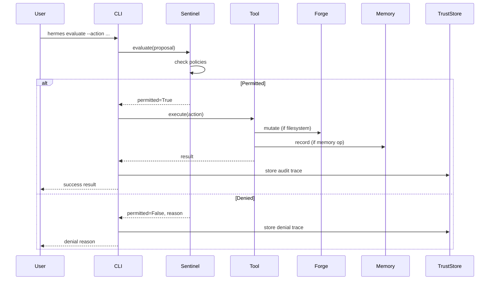

# Hermes Prime Architecture

```mermaid
graph TB
    subgraph CLI_Layer["CLI Layer"]
        CLI["hermes / hermes-prime / sentinel"]
        Parser[Argument Parser<br/>two-pass dispatch]
        Doctor["hp-doctor"]
        Repair["repair"]
        Inspect["inspect"]
        Mint["mint"]
        Evaluate["evaluate"]
        Patch["patch"]
        Replay["replay"]
        Memory["hp-memory"]
        Agents["agents"]
        Graphify["graphify"]
        Kanban["kanban"]
        Tools["tools"]
        Skills["skills"]
        REPL["repl"]
        Dashboard["hp-dashboard"]
        TUI["tui"]
    end

    subgraph Governance_Layer["Governance Layer"]
        Sentinel[SentinelService]
        PolicyEngine[PolicyEngine<br/>Rego rules]
        OPA[OPA Adapter<br/>Native / WASM]
        CapVault[CapabilityVault]
        TrustStore[TrustStore<br/>SQLite audit traces]
        GovernanceHooks[GovernanceHooks]
    end

    subgraph Agent_Layer["Agent Layer"]
        ToolRegistry[ToolRegistry]
        GovernedDispatcher[GovernedToolDispatcher]
        AgentLoop[Agent Loop]
        REPL_Session[Interactive REPL]
        KanbanBoard[KanbanBoard]
        SkillsSystem[Skills System]
    end

    subgraph Tools["Agent Tools"]
        Terminal[terminal_execute]
        CodeExec[execute_code]
        WebSearch[web_search]
        WebFetch[web_fetch]
        Voice[voice]
        Vision[vision]
        Todo[todo]
    end

    subgraph Memory_Layer["Memory & Learning"]
        MemoryStore[MemoryStore]
        Consolidator[ReflectiveConsolidator]
        SQLiteBackend[SQLite Backend]
        MemPalaceBackend[MemPalace Backend]
        GraphifyBackend[Graphify Backend]
        KnowledgeGraph[KnowledgeGraph]
        DecayScheduler[DecayScheduler]
        Governing[MemoryGovernor]
        ProvenanceLinker[ProvenanceLinker]
        LearningEngine[LearningEngine]
        OutcomeTracker[OutcomeTracker]
    end

    subgraph Infrastructure["Infrastructure"]
        SandboxedForge[SandboxedForge]
        AstMiner[AST Miner]
        FileMiner[File Miner]
        GrepMiner[Grep Miner]
        FabricMiners[Fabric Miners]
        VaultClient[VaultClient<br/>hvac / env fallback]
        HMACSigner[HMACSigner]
    end

    subgraph External["External Dependencies"]
        OPA_Ext["OPA (openpolicyagent.org)"]
        Ripgrep["ripgrep (rg)"]
        TreeSitter["tree-sitter"]
        Wasmtime["wasmtime"]
        Ollama["Ollama"]
        VLLM["vLLM"]
        ChromaDB["ChromaDB"]
        MemPalace["MemPalace"]
        Graphify_Ext["Graphify"]
    end

    subgraph Storage["Storage & State"]
        TrustDB["trust.db<br/>audit traces"]
        MemoryDB["memory.db<br/>claims & facts"]
        KanbanDB["kanban.db"]
        SkillsDB["skills.db"]
        GraphData["graph.json"]
    end

    CLI --> Parser
    Parser --> Doctor
    Parser --> Repair
    Parser --> Inspect
    Parser --> Mint
    Parser --> Evaluate
    Parser --> Patch
    Parser --> Replay
    Parser --> Memory
    Parser --> Agents
    Parser --> Graphify
    Parser --> Kanban
    Parser --> Tools
    Parser --> Skills
    Parser --> REPL
    Parser --> Dashboard
    Parser --> TUI

    Doctor --> Sentinel
    Repair --> TrustStore
    Evaluate --> Sentinel
    Patch --> SandboxedForge
    Memory --> MemoryStore
    Agents --> GovernedDispatcher
    Kanban --> KanbanBoard
    Tools --> ToolRegistry
    Skills --> SkillsSystem
    REPL --> REPL_Session

    Sentinel --> PolicyEngine
    PolicyEngine --> OPA
    OPA --> OPA_Ext
    Sentinel --> TrustStore
    CapVault --> TrustStore
    GovernanceHooks --> Sentinel

    ToolRegistry --> Terminal
    ToolRegistry --> CodeExec
    ToolRegistry --> WebSearch
    ToolRegistry --> WebFetch
    ToolRegistry --> Voice
    ToolRegistry --> Vision
    ToolRegistry --> Todo

    GovernedDispatcher --> Sentinel
    GovernedDispatcher --> ToolRegistry
    GovernedDispatcher --> CapVault

    MemoryStore --> SQLiteBackend
    MemoryStore --> MemPalaceBackend
    MemoryStore --> GraphifyBackend
    MemoryStore --> KnowledgeGraph
    MemoryStore --> Consolidator
    MemoryStore --> DecayScheduler
    MemoryStore --> Governing
    MemoryStore --> ProvenanceLinker
    Consolidator --> LearningEngine

    SQLiteBackend --> MemoryDB
    MemPalaceBackend --> MemPalace
    GraphifyBackend --> Graphify_Ext
    GraphifyBackend --> GraphData

    LearningEngine --> OutcomeTracker

    Sentinel --> GovernanceHooks
    GovernanceHooks --> AgentLoop

    TrustStore --> TrustDB
    KanbanBoard --> KanbanDB
    SkillsSystem --> SkillsDB

    VaultClient --> CapVault
    HMACSigner --> TrustStore
```

## Component Descriptions

### CLI Layer
The CLI provides three entry points (`hermes`, `hermes-prime`, `sentinel`) with a two-pass dispatch system. Known Hermes Prime commands are handled natively; unknown commands fall through to the upstream `hermes-agent` CLI.

### Governance Layer
Sentinel is the deterministic policy engine powered by OPA/Rego. Every action proposal is evaluated against policy rules before execution. The TrustStore provides an immutable audit trail of all decisions.

### Agent Layer
The agent system includes a tool registry with governed dispatch, an interactive REPL, a kanban board for multi-agent coordination, and a skills system for reusable capabilities.

### Agent Tools
Seven built-in tools provide terminal execution, code execution, web search/fetch, voice, vision, and task management. All tools are governed by Sentinel policy evaluation.

### Memory & Learning
Six memory tiers (working, episodic, reflective, semantic, strategic, governance) with configurable backends. The ReflectiveConsolidator compresses experiences into patterns. The LearningEngine tracks outcomes and builds behavioral patterns over time.

### Infrastructure
Sandboxed Forge provides hash-chained filesystem mutations with instant rollback. Miners (AST, file, grep, fabric) extract structured information from codebases with signed attestations.

## Data Flow

## Key Design Decisions

| Decision | Rationale |
|----------|-----------|
| Deterministic governance first | All actions pass through OPA before LLM involvement |
| Sandboxed execution | Forge provides hash-chained rollback for all filesystem mutations |
| Signed attestations | Every action, memory, and decision is cryptographically signed via HMAC |
| Pluggable memory backends | SQLite default, MemPalace for embeddings, Graphify for knowledge graphs |
| Two-pass CLI dispatch | HP commands handled first; unknown commands passthrough to upstream agent |
